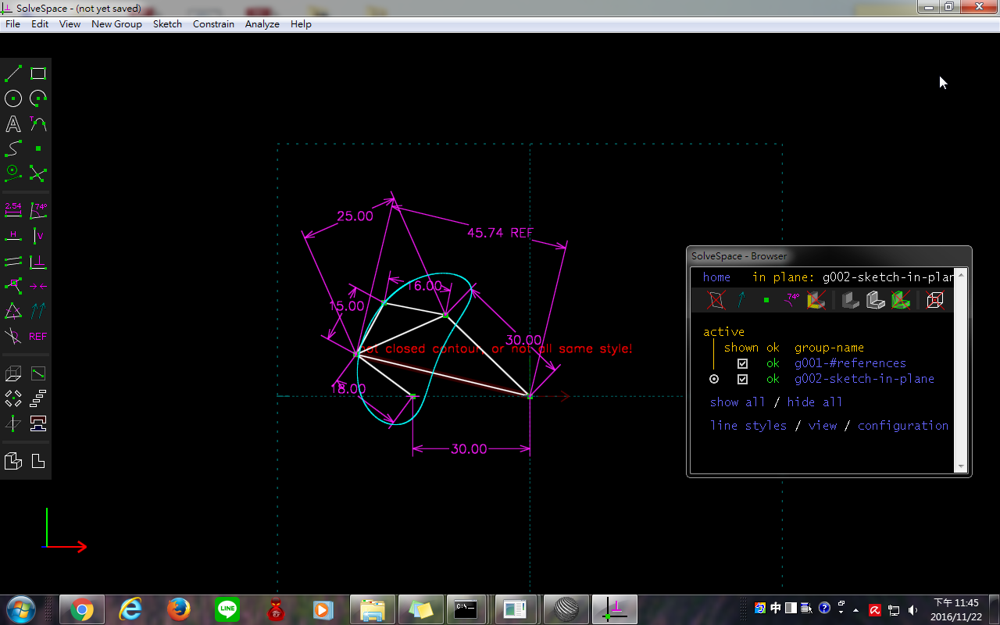
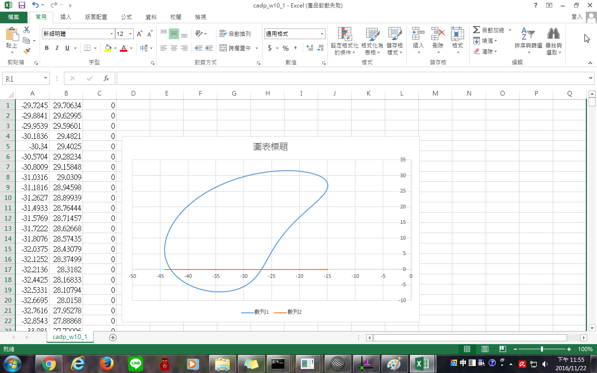

Title: Week 10
Date: 2016-11-18 12:00
Category: Misc
Tags: 使用導引, 創造力, 表達能力, 協同設計
Author: 40423229

Solvespace 平面四連桿機構模擬

直接利用 Solvespace 畫出繞行路徑

以 Excel 畫圖

<iframe src="https://player.vimeo.com/video/194281041" width="640" height="400" frameborder="0" webkitallowfullscreen mozallowfullscreen allowfullscreen></iframe>

<a href="https://vimeo.com/194281041">cadp w10</a> from <a href="https://vimeo.com/user47808963">40423229</a> on <a href="https://vimeo.com">Vimeo</a>.

